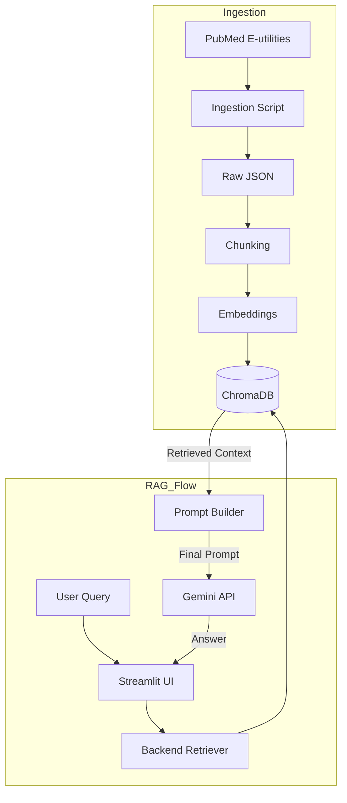

# PubMed Medical RAG

## Summary

A minimal **end-to-end medical Retrieval-Augmented Generation (RAG) system** that helps healthcare professionals find accurate, evidence-based answers from medical literature. It ingests [PubMed articles](https://pubmed.ncbi.nlm.nih.gov/), chunks them using two strategies, embeds and stores them in a vector database ([ChromaDB](https://www.trychroma.com/)), retrieves relevant context for a medical question, and generates grounded answers with a Large Language Model ([Google Gemini LLM](https://ai.google.dev/gemini-api/docs)), through a simple User Interface ([Streamlit UI](https://streamlit.io/)).

## Overview: What this project does

This project answers medical literature questions using only retrieved PubMed article context. The pipeline:

1. fetches article metadata and abstracts from PubMed using National Center for Biotechnology Information (NCBI) E-utilities
2. stores the raw data in structured JSON
3. creates chunks using both fixed-size and section-based strategies
4. embeds chunks with `sentence-transformers/all-MiniLM-L6-v2`
5. stores them in ChromaDB with metadata
6. retrieves top-k relevant chunks for a user query
7. prompts Gemini to answer using only the retrieved context and cite PMIDs
8. returns the answer and sources in a Streamlit app.

## Tech stack

- Python 3.10+
- PubMed / NCBI E-utilities for ingestion
- HuggingFace `sentence-transformers/all-MiniLM-L6-v2` for embeddings
- ChromaDB for vector storage and retrieval
- Gemini LLM/s via `google-genai` for answer generation
- Streamlit for the demo UI

## Repository structure

```text
pubmed-rag/
├── README.md
├── LICENSE
├── requirements.txt
├── .env
├── ingest/
│   ├── pubmed_fetcher.py
│   └── data/
├── chunking/
│   ├── chunker.py
│   └── comparison.md
├── vectordb/
│   ├── embeddings.py
│   ├── store.py
│   └── db/
├── rag/
│   ├── pipeline.py
│   └── prompts.py
├── docs/
├── evaluate/
│   └── test_queries.py
├── write-up
│   └── PubMed_RAG_Write_up.pdf
├── app.py
└── utils.py
```

## Architecture diagram



## Setup instructions

1. Clone the repository
   ```bash
   git clone <YOUR_REPO_URL>
   cd pubmed-rag
   ```
2. Create and activate a virtual environment (macOS / Linux)
   ```bash
   python3 -m venv .venv
   source .venv/bin/activate
   ```
3. Install dependencies
   ```bash
   pip install -r requirements.txt
   ```
4. Create your environment file in the root directory
   ```bash
   touch .env
   ```
5. Add your API Keys to the _.env_ file
   ```bash
   NCBI_API_KEY=<YOUR_NCBI_TOKEN>
   HF_TOKEN=<YOUR_HUGGING_FACE_TOKEN>
   GEMINI_API_KEY=<YOUR_GEMINI_TOKEN>
   ```

### End-to-end run order

Run the project in this order.

1. Ingest PubMed articles

   ```bash
   python -m ingest.pubmed_fetcher
   ```

   This script:
   - queries PubMed with esearch
   - fetches article metadata and abstracts with efetch
   - saves raw XML data to `ingest/data/XML/<topic>_pubmed.xml`
   - preserves title, abstract, authors, publication date, PMID, and MeSH terms
   - saves structured JSON output to `ingest/data/JSON/pubmed_articles.json`.

2. Create chunk files

   ```bash
   python -m chunking.chunker
   ```

   This generates:
   - `chunking/data/chunks_fixed.jsonl`
   - `chunking/data/chunks_section.jsonl`

3. Build the vector index

   ```bash
   python -m vectordb.store --strategy section
   python -m vectordb.store --strategy fixed
   ```

   This:
   - embeds all chunks
   - stores them in ChromaDB
   - preserves metadata for retrieval
   - creates persistent local collections.

4. Run retrieval evaluation

   ```bash
   python -m evaluate.test_queries
   ```

   This runs the sample-style evaluation queries and prints retrieved chunks to verify the retrieval is sensible, including the unrelated query case.

5. Launch the UI

   ```bash
   streamlit run app.py
   ```

   The UI includes:
   - a text input for the medical question
   - a Search button
   - generated answer display
   - source citations with PMIDs and titles
   - optionally the retrieved chunks.

6. Example workflow
   - After indexing, you can ask questions such as:
     - What are the current first-line treatments for type 2 diabetes?
     - What are the side effects of ACE inhibitors in hypertension?
     - How effective are inhaled corticosteroids for childhood asthma?
     - Compare metformin and sulfonylureas for glycemic control

   - You can also test an unrelated query like:
     - What is a completely unrelated topic like quantum computing?
       - _Expected behavior for unrelated questions: the system should return an insufficient-information response rather than produce an unsupported answer._

## Design decisions

### Data ingestion choices

- I chose three topics that are close to the sample validation queries.
  - diabetes
  - hypertension
  - asthma
- This makes it easier to validate the RAG system against the sample test questions while still satisfying the requirement to ingest at least 50 PubMed articles across 2–3 topics.

The ingested PubMed articles are stored in JSON with fields such as:

```json
{
  "pmid": "38992869",
  "title": "Current type 2 diabetes guidelines: ...",
  "abstract": "Evidence-based guidelines provide ...",
  "authors": ["Juliana C N Chan", "Aimin Yang", "..."],
  "publication_date": "2024-Aug",
  "mesh_terms": ["Diabetes Mellitus, Type 2", "Metformin", "..."],
  "topic": "diabetes"
}
```

### Chunking strategies

This project implements two chunking strategies.

1. Fixed-size chunking: A simple overlapping word-based chunking approach over article title + abstract.
   - Why I included it:
     - simple baseline
     - robust to inconsistent formatting
     - easy to reproduce.

   - Trade-off:
     - can split related concepts across chunk boundaries.

2. Section-based chunking: A structure-aware approach that looks for labeled abstract sections such as, Background, Methods, Results, and Conclusion.
   - If the abstract is unlabeled, the code falls back to paragraph-based or full-abstract chunking.
   - Why I included it:
     - better semantic coherence
     - better alignment with how medical abstracts are structured
     - usually better for grounded citation.

   - Trade-off:
     - depends on article formatting
     - section labels are not always consistent.

#### Recommendation

My recommended default strategy is section-based chunking, with fixed-size chunking as a fallback. This satisfies the requirement to compare at least two strategies and recommend one. See `chunking/comparison.md` for the short write-up.

### Embeddings and vector database

1. Embedding model
   - I used `sentence-transformers/all-MiniLM-L6-v2` because
     - free and local
     - fast on CPU
     - strong enough for a small corpus.

2. Vector DB
   - I used ChromaDB because it is:
     - local
     - Python-native
     - free
     - easy to persist and inspect.
   - Retrieval uses top-k similarity search with Euclidean distance (L2) over embedded chunks and returns metadata including: PMID, title, section, chunk index, chunking strategy, and topic.

### RAG pipeline and prompt design

1. RAG pipeline
   - The RAG pipeline does the following:
     - accept a user question
     - retrieve top-k relevant chunks
     - build a prompt containing the retrieved context and the question
     - send the prompt to Gemini
     - return an answer with citations.
2. Prompt design
   - Prompt v1
     - The first version instructed the model to:
       - answer only from provided context
       - be concise
       - cite PMIDs
       - say context is insufficient when needed.

   - Prompt v2
     - The second version improved on v1 by:
       - explicitly forbidding outside knowledge
       - requiring citations for important medical claims
       - using an exact fallback phrase for insufficient context
       - instructing the model to acknowledge mixed findings when sources disagree.

### Handling insufficient context

A key requirement is not just retrieval quality, but correctly handling the "no relevant context" case. The pipeline includes a retrieval sufficiency check before generation. If the retrieved chunks are too weak, the system returns

```text
I don't have enough information from the retrieved articles.
```

- Context Sufficiency Heuristic
  - To prevent the LLM from hallucinating on irrelevant data, I implemented a Dual-Condition Heuristic that validates retrieval quality before triggering a generation.
  - Core Logic: A search is considered "sufficient" only if it meets two specific criteria:
    1. **Proximity (Threshold):** Each candidate chunk must fall below a maximum Distance Threshold, ensuring it is mathematically "close" to the user's query in vector space.
    2. **Density (Volume):** A minimum number of "good" chunks must be present. Requiring at least two matching sources provides stronger evidence that the retrieval is consistently on-topic rather than a single accidental keyword match.

  - L2 (Euclidean) Distance Reference
    - The following scale approximately determines the semantic relationship between the query and the retrieved medical text:
      - 0.0 – 0.5 (Strong Match): High confidence; likely a direct answer or the exact study being referenced.
      - 0.5 – 1.0 (Relevant): Solid semantic match; provides reliable clinical context.
      - 1.0 – 1.3 (Weak/Borderline): May contain relevant keywords but lacks deep topical alignment.
      - 1.3+ (Noise/Mismatch): Generally irrelevant; ignored to maintain medical accuracy and prevent "hallucinated" connections.
  - Outcome
    - If the criteria are not met, the system identifies the context as insufficient. This allows the agent to provide a safe "I don't know" response rather than attempting to answer using noisy or unrelated data.

### Evaluation

- The retrieval evaluation script runs the sample-style questions, and for each query, the evaluation script prints:
  - the retrieved chunks
  - titles and PMIDs
  - retrieval scores
  - a short preview of each chunk.

### Error handling

- I added basic error handling in the areas most likely to fail during a fresh run:
  - PubMed request retry logic
  - skipping records with missing abstracts
  - safe handling of missing fields like MeSH terms
  - empty retrieval guard
  - missing Gemini API key check
  - error handling for Gemini API failure
  - simple insufficient-context fallback
  - empty UI input validation.

### User Interface

- I used Streamlit because it is a fastest way to produce a runnable, functional demo UI with little overhead.

## Trade-offs

- Main trade-offs:
  - word-based chunking rather than exact tokenizer-based chunking
  - simple retrieval threshold heuristic rather than calibrated retrieval scoring
  - no automated retrieval metrics beyond simple qualitative evaluation.

- These trade-offs were chosen to maximize clarity, reproducibility, and completion within project's timeline.

## Future work

1. A reranking step using a cross-encoder before sending chunks to Gemini
2. Hybrid retrieval combining BM25 and dense similarity
3. Better automatic evaluation for retrieval and answer grounding
4. Score-distribution and chunk-overlap visualization
5. Citation highlighting at the chunk level
6. Docker support for one-command execution
7. A richer UI with feedback signals
8. Improve the prompts with few-shot learning
